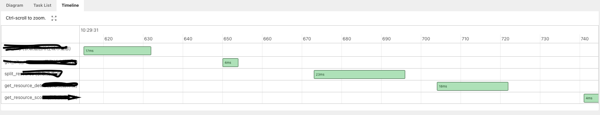
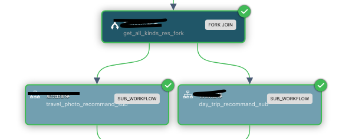
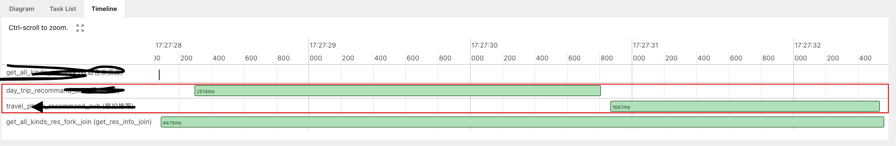
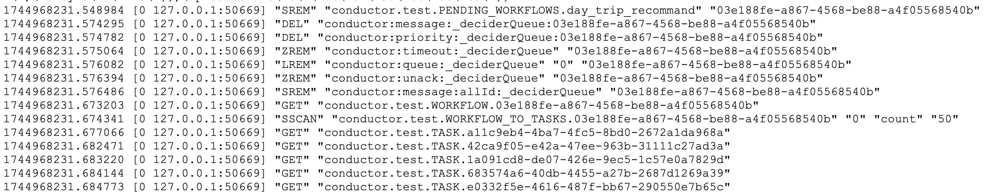

# 简介

[conductor-oss/conductor](https://github.com/conductor-oss/conductor) 的支持同步调用的版本。

# 部署与使用

1. 安装 redis
2. 编译，运行 `build.sh`
3. 启动后端，运行 server 目录中的 Conductor 的 main 方法
4. 启动前端
   1. 进入 ui mul
   2. 运行 yarn install （首次运行需要先安装必要的包）
   3. 运行 yarn start 
5. 定义规则，在页面的 Definitions 中定义工作流，可使用如下工作流测试

```json
{
  "createTime": 1742551154443,
  "updateTime": 1743073062782,
  "name": "getIp",
  "description": "Edit or extend this sample workflow. Set the workflow name to get started",
  "version": 8,
  "tasks": [
    {
      "name": "switch_task",
      "taskReferenceName": "switch_task",
      "inputParameters": {
        "ip": "${workflow.input.ip}"
      },
      "type": "SWITCH",
      "decisionCases": {
        "local": [
          {
            "name": "get_local_ip",
            "taskReferenceName": "get_local_ip",
            "inputParameters": {
              "http_request": {
                "uri": "https://qifu-api.baidubce.com/ip/local/geo/v1/district",
                "method": "GET"
              }
            },
            "type": "HTTP",
            "decisionCases": {},
            "defaultCase": [],
            "forkTasks": [],
            "startDelay": 0,
            "joinOn": [],
            "optional": false,
            "defaultExclusiveJoinTask": [],
            "asyncComplete": false,
            "loopOver": [],
            "onStateChange": {},
            "permissive": false
          }
        ],
        "other": [
          {
            "name": "get_other_ip",
            "taskReferenceName": "get_other_ip",
            "inputParameters": {
              "http_request": {
                "uri": "https://qifu-api.baidubce.com/ip/geo/v1/district?ip=${workflow.input.ip}",
                "method": "GET"
              }
            },
            "type": "HTTP",
            "decisionCases": {},
            "defaultCase": [],
            "forkTasks": [],
            "startDelay": 0,
            "joinOn": [],
            "optional": false,
            "defaultExclusiveJoinTask": [],
            "asyncComplete": false,
            "loopOver": [],
            "onStateChange": {},
            "permissive": false
          }
        ]
      },
      "defaultCase": [],
      "forkTasks": [],
      "startDelay": 0,
      "joinOn": [],
      "optional": false,
      "defaultExclusiveJoinTask": [],
      "asyncComplete": false,
      "loopOver": [],
      "evaluatorType": "javascript",
      "expression": "$.ip === null || $.ip === undefined || $.ip === '' ? 'local' : 'other'",
      "onStateChange": {},
      "permissive": false
    }
  ],
  "inputParameters": [],
  "outputParameters": {
    "localIp": "${get_local_ip.output.response.body.data}",
    "otherIp": "${get_other_ip.output.response.body.data}"
  },
  "schemaVersion": 2,
  "restartable": true,
  "workflowStatusListenerEnabled": true,
  "ownerEmail": "example@email.com",
  "timeoutPolicy": "ALERT_ONLY",
  "timeoutSeconds": 0,
  "variables": {},
  "inputTemplate": {},
  "enforceSchema": true
}
```

6. 在页面的 Workbench 中测试，此时使用的是异步接口
7. 使用http 客户端工具执行以下请求，即为同步接口调用

```http
POST http://localhost:8080/conductor/api/workflow/run
Content-Type: application/json

{
    "name": "getIp",
    "version": 1,
    "input":
    {
        "ip": "112.60.14.252"
    }
}
```


# 主要变更

## 新增任务类型支持

3. 支持SpEL
   - 用于数据格式转换、数值计算

```json
{
    "template": "{\"countAll\":{{apple.price*apple.count+banana.price*banana.count}}}",
    "input":
    {
        "apple":
        {
            "name": "apple",
            "price": 2.5,
            "count": 12
        },
        "banana":
        {
            "name": "banana",
            "price": 3,
            "count": 10
        }
    }
}
```


4. 支持Pebble模板引擎
   - 用于数据格式转换

```json
{
    "template": "{\"fruitName\":\"{{name}}\",\"fruitPrice\":{{price}},\"fruitCount\":{{count}},\"total\":{{price*count}}}",
    "input":
    {
        "name": "apple",
        "price": 2.5,
        "count": 12
    }
}
```


7. Groovy

```json
    {
      "inputParameters": {
        "input": {
          "name": "zhangsan",
          "value": 3
        },
        "expression": "return input.name + '-' + input.value"
      },
      "type": "GROOVY"
    }
```

```json
    {
      "inputParameters": {
        "name": "zhangsan",
        "value": 3,
        "evaluatorType": "groovy",
        "expression": "return input.name + '-' + input.value"
      },
      "type": "INLINE"
    }
```


## 新增同步支持

Conductor 更适合处理以下场景：

- 复杂长时间运行的工作流（如数分钟到数小时）。

- 高并发任务、事件驱动的异步任务。

- 需要灵活扩展和高容错性的任务。

### 情况与问题：

- 问题1：项目本身提供的方案，工作流的启动与结果获取是两个接口
  - 执行完成与获取到结果存在时间间隔
  - 需要轮询，存在不小的开销
- 问题2：工作流利的任务，会被根据类型拆分到不同的队列，由专门的定时任务拉取并执行
  - 在工作流包含的任务数较多时，等待耗时非常可观，最简单的任务，最终耗时都在秒级


[Conductor UI - Execution - aabfe4a6-d3af-4d00-9dd7-acf77930785a](https://cvg.t.17usoft.com/conductorfront/execution/aabfe4a6-d3af-4d00-9dd7-acf77930785a)



- 任务之间都存在等待耗时
- 执行耗时为63ms，但请求的总耗时长达543ms
- 轮询获取结果有需要额外的耗时，总时长达到秒级


### 解决方案

- 问题1：
  - 第一版方案：基于状态监听机制缩短等待时间，但是仍然需要轮询。
  - 第二版方案：提供同步接口（商业版包含同步接口，收费）
- 问题2：
  - 将所有任务同步执行，解决任务间的长时间间隔。
  - 让子工作流、fork任务并发执行，解决工作流之间同步等待问题。





### 压缩响应耗时

- 对于调试请求（web页面），保留观测数据

- 对于非调试请求（接口调用），去除非必要IO，极限压缩响应时间
   1. 去除用于观测的ES存储与查询操作
   2. 通过请求上下文传递数据变化，不再写入redis，以确保没有新增数据
   3. 使用 monitor 监控所有数据操作，去除接口请求的所有非任务redis操作（禁用部分功能）
   4. 本地缓存工作流定义



当前非调试请求已可以做到执行期间完全不访问外部存储

- 增加工作流缓存

```json
  "cacheConfig": {
    "ttlInSecond": 60,
    "key": "city:${cityId}"
  }
```

